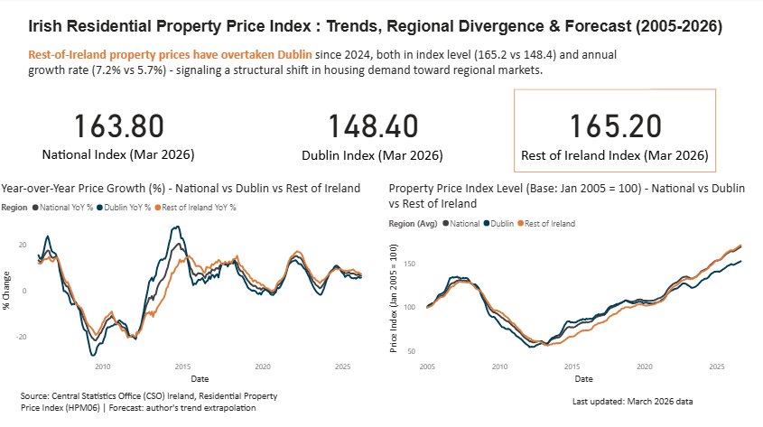
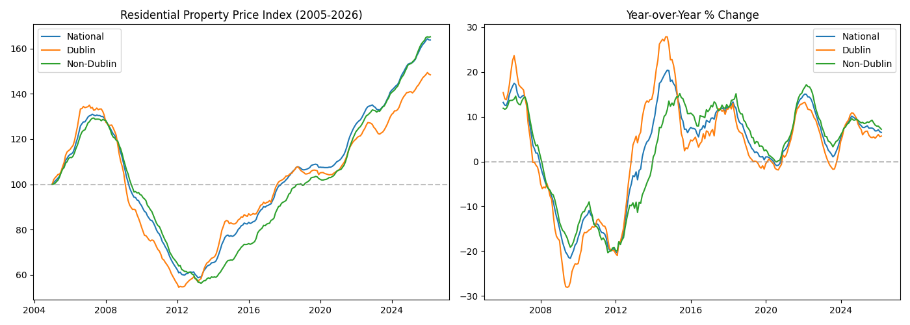
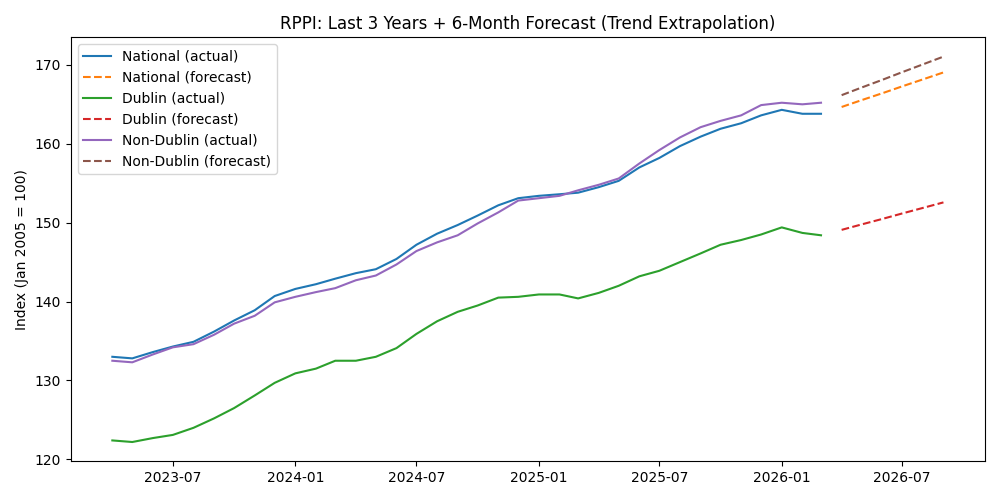

# Irish Residential Property Price Dashboard

An analysis of Irish residential property price trends (2005–2026), comparing Dublin vs the rest of Ireland, with a short-term forecast and an interactive Power BI dashboard.

## Business Question
With property prices diverging significantly across Irish regions, where is the housing market moving — and what does this mean for someone relocating to Ireland?

## Key Finding
Rest-of-Ireland property prices have overtaken Dublin since 2024, both in absolute index level (165.2 vs 148.4 as of March 2026) and annual growth rate (7.2% vs 5.7%), signaling a structural shift in housing demand toward regional markets — likely driven by remote work and Dublin affordability pressure.

## Data Source
Central Statistics Office (CSO) Ireland — Residential Property Price Index (HPM06), monthly data Jan 2005 – Mar 2026. Publicly available via [data.gov.ie](https://data.gov.ie/dataset/hpm06-residential-property-price-index).

## Methodology
1. **Data cleaning** (`scripts/clean_data.py`): Filtered raw CSO data to the index-level series, parsed dates, pivoted to wide format, and calculated month-over-month and year-over-year % changes for National, Dublin, and Rest-of-Ireland series.
2. **Exploratory analysis**: Identified the boom (2005–2007), bust (2008–2012), and recovery (2013–present) cycle, and the recent divergence between Dublin and Rest-of-Ireland growth rates.
3. **Forecasting**: 6-month forward projection using 12-month trailing CAGR (compound monthly growth rate) extrapolation — chosen for interpretability over black-box models, since the business question concerns trend direction rather than precise point estimates.
4. **Dashboard**: Built in Power BI, combining actual and forecast data into a single continuous series for visualization.

## Dashboard

The dashboard highlights the latest index values, the year-over-year growth divergence between regions, and the long-run price index trend since 2005.

## Exploratory Data Analysis

The data shows a clear boom-bust-recovery cycle: prices peaked in 2007, crashed by roughly 45% by 2012-13 (Celtic Tiger bust), and have been recovering steadily since 2013, now at all-time highs nationally.

## Forecast

Using 12-month trailing CAGR extrapolation, Rest-of-Ireland prices are projected to continue outpacing Dublin over the next 6 months, reinforcing the regional shift identified in the EDA.

## Repository Structure
- `data/` — raw and cleaned CSV files
- `scripts/clean_data.py` — data cleaning and transformation
- `scripts/eda_analysis.py` — exploratory analysis and trend visualization
- `scripts/forecast_analysis.py` — 6-month price forecast model
- `images/` — exploratory plots and dashboard screenshots
- `dashboard/` — Power BI dashboard file

## Tools Used
Python (pandas, matplotlib), Power BI, CSO open data and AI coding assistants (Claude) were used to accelerate script development, debugging, and dashboard troubleshooting. All methodology, analysis decisions, and findings were reviewed and validated by the author.

## Author
Hitesh Srinivas

[LinkedIn](https://www.linkedin.com/in/hitesh-s-116380252/) | [Email](mailto:srinihitesh37@gmail.com)
